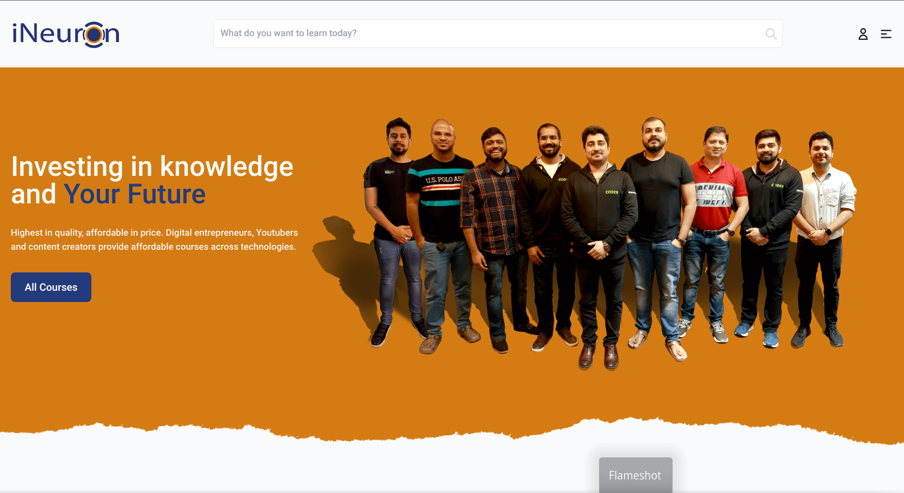

# iNewron

# iNeuron Landing Page Redesign

> iNewron

<table>
<tr>
<td>
  A landing page designed using HTML, CSS, and JavaScript along with 2 external libraries.
</td>
</tr>
</table>

### About

- This website was designed for Hackathon hosted on Findcoder.io. It was fun doing this hackathon project, thank you findcoder.io team for hosting the challenge.

### Screenshot

## Device support

The site is compatible with almost all screen sizes except for smart watch screens.

## Author

